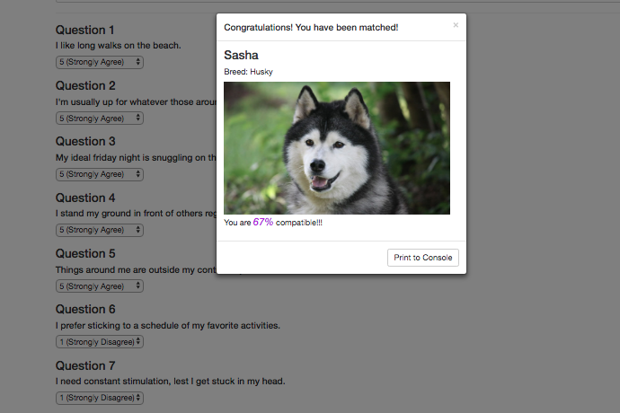

# Friend-Finder
PawPal is an online application that helps you find your next four-legged friend. It is a full-stack application, and is live at https://radiant-shore-92391.herokuapp.com.

## Description

PawPal is a full-stack application similar to your typical survey-based dating app, except that it is intended for dog-owners to find new four-legged friends for their own pets. Before searching, the user is prompted to fill out their dog's name, breed, and a link to a photo. They then are asked ten personality questions to match them with the most compatible dog in the system. They are then shown the name, breed, and picture of the dog they are paired with, along with the compatibility score.

### Development

This application was developed as part of the GW Coding Bootcamp and was completed during the seventh week. It was the first full-stack project built in the program. It makes use of Bootstrap (including Bootstrap jQuery) on the front end, and Express, Body-Parser, and Path on the back-end.

### Organization

This repo can be cloned to your computer and accessed using the following commands:

		git clone https://github.com/jonchr/Friend-Finder.git
		cd Friend-Finder
		node server.js

The latest command will run the local server and will print the message "Running on PORT 3000" when completed. Once you receive this message, open "localhost:3000" in your browser. To stop the server, press Control-C while in your command prompt window.

## Screenshots
### You have been matched with Sasha!
